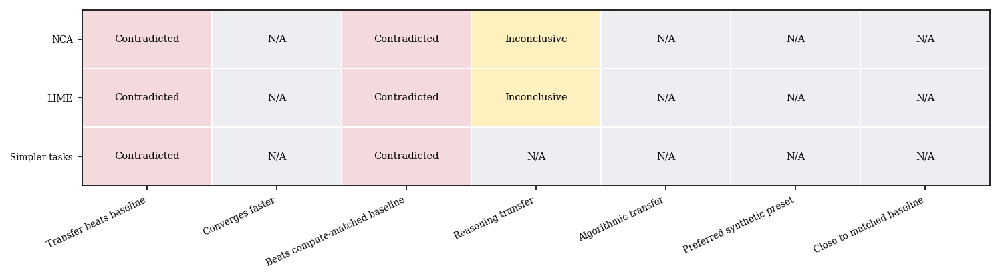
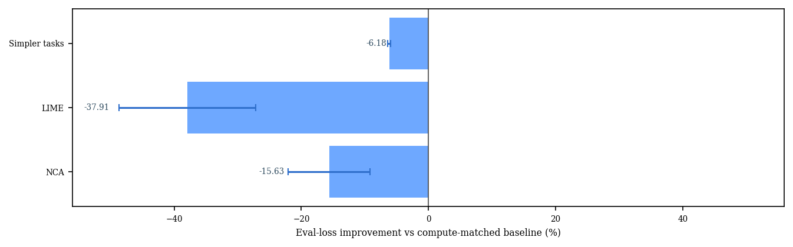
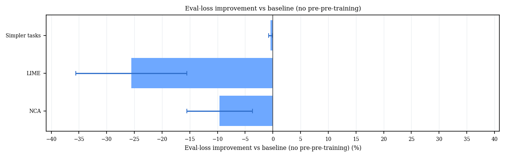
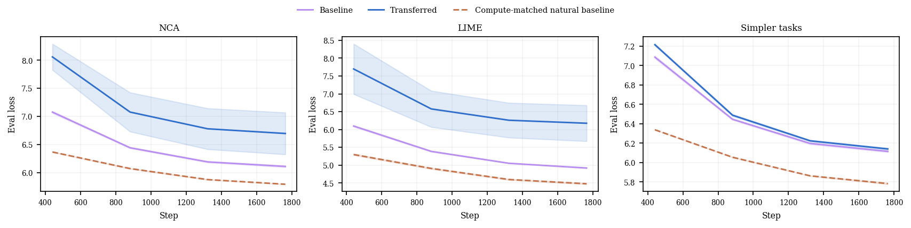
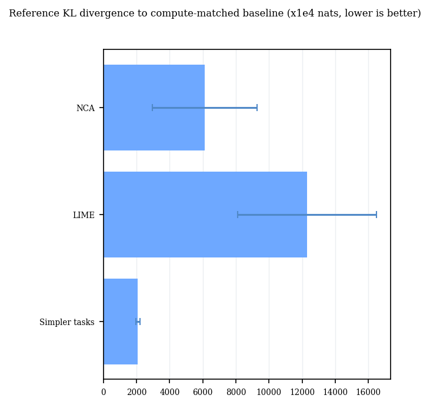
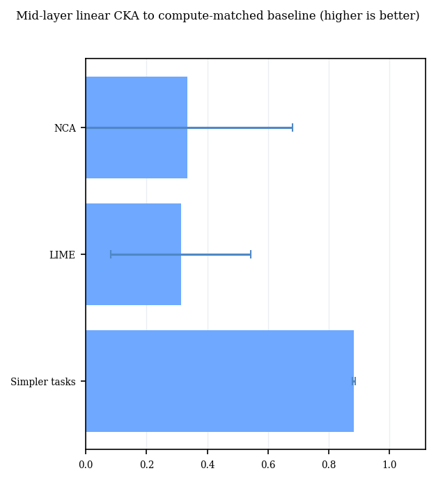
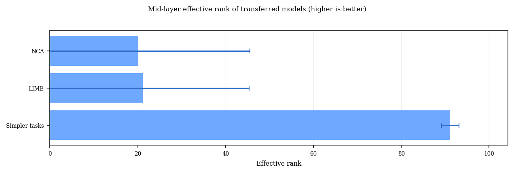
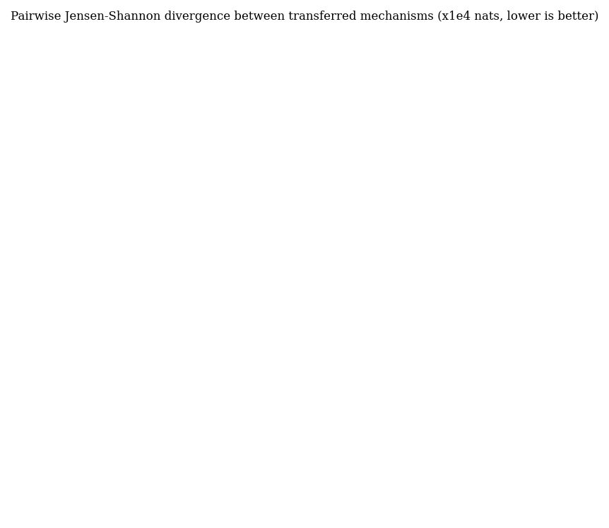
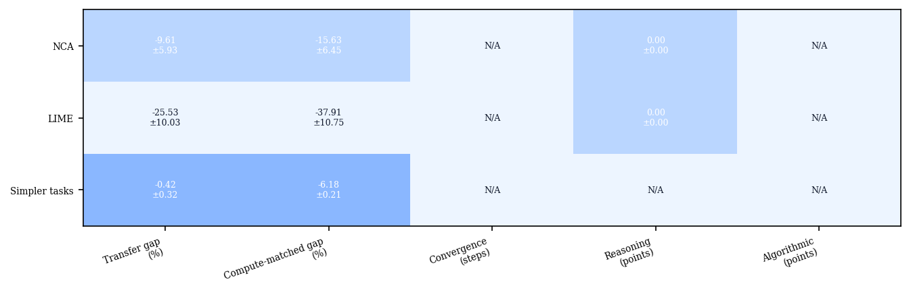

# Proxy Study Report

This report summarizes a bounded multi-seed proxy study across the current pre-pre-training mechanisms.
The goal is not exact paper reproduction, but a consistent check of whether each mechanism transfers in the expected direction under one shared setup.
All mechanisms are additionally evaluated against a compute-matched natural baseline built from natural-text warm-up on the same downstream text family.
Aggregated claim outcomes use a simple three-seed rule rather than a hypothesis test.
In the table, `✅` means the three runs had a better average in the target direction and at least 2 of the 3 seeds moved in that direction, `❌` means the opposite pattern held, `❔` means the result was inconclusive, and `➖` means the claim was not evaluated for that mechanism in this profile.

### Key Results

| mechanism | Transfer beats baseline | Converges faster | Beats compute-matched baseline | Reasoning transfer | Algorithmic transfer | Preferred synthetic preset | Close to matched baseline |
| --- | --- | --- | --- | --- | --- | --- | --- |
| NCA | ❌ | ➖ | ❌ | ❔ | ➖ | ➖ | ➖ |
| LIME | ❌ | ➖ | ❌ | ❔ | ➖ | ➖ | ➖ |
| Simpler tasks | ❌ | ➖ | ❌ | ➖ | ➖ | ➖ | ➖ |

### Claim Matrix Plot

This matrix shows the aggregated claim outcomes. Rows are mechanisms, columns are natural-language claim categories, and each cell reports whether the corresponding proxy claim was supported, contradicted, or left inconclusive after aggregating across seeds.

### Compute-Matched Baseline Gap

This plot shows the mean percentage evaluation-loss improvement of each transferred run over its compute-matched natural baseline, with standard deviation across seeds. Positive values mean the synthetic pre-pre-training path finished with lower evaluation loss than the matched natural-text baseline.

### Eval-Loss Difference Compared To Baseline

This plot shows the mean percentage evaluation-loss improvement of the transferred run over the baseline run with no pre-pre-training after the same downstream training budget, with standard deviation across seeds. Positive values mean the transferred model finished with lower loss than the baseline.

### Convergence Step Delta

This plot shows how many optimization steps earlier the transferred model reaches the baseline run's final loss level. Positive values indicate faster convergence.

### Loss Overlays

This figure overlays the downstream evaluation-loss curves for the baseline, transferred, and compute-matched natural baseline runs for each mechanism. Study-specific synthetic comparison presets are intentionally excluded so the overlay stays focused on the main proxy comparison. Solid lines are means across seeds and shaded bands show one standard deviation.

### Logit Divergence To Baseline

This plot compares each mechanism's transferred model against its own compute-matched natural baseline using reference KL divergence over held-out downstream tokens. Values are plotted in x1e4 nats for readability. Lower values mean the transferred predictive distribution is closer to the matched compute baseline.
LIME and Summarization use different downstream text families from the other mechanisms, so their KL and CKA values are partly affected by that dataset difference and should not be over-read as if every mechanism used the same held-out distribution.

### Activation CKA To Baseline

This plot compares each mechanism's transferred model against its own compute-matched natural baseline using midpoint linear CKA on held-out downstream tokens. Higher values mean the internal representation geometry is more similar despite different parameter initializations.

### Activation Effective Rank

This figure measures the effective rank of midpoint hidden states for transferred models on held-out downstream tokens. Higher values indicate more diverse internal representations rather than collapsed activity.

### Pairwise Logit Divergence Matrices

This heatmap shows pairwise Jensen-Shannon divergence between transferred mechanisms on one shared diagnostic text bundle. Values are shown as mean plus-or-minus standard deviation in x1e4 nats across seeds. Lower values indicate more similar predictive distributions.

### Pairwise Activation CKA Matrices

This heatmap shows pairwise midpoint linear CKA between transferred mechanisms on one shared diagnostic text bundle. Higher values indicate more similar internal representation structure.

### Effect Summary

This summary heatmap collects the main mechanism-level effect sizes in one place. Each column is scaled independently for readability and cell text shows the raw mean plus-or-minus standard deviation.

### Run Metrics

| mechanism | preset | seeds | baseline loss | transferred loss | natural baseline loss | transfer gap % | baseline gap % | convergence delta | reasoning gain | algorithmic gain | transferred KL | transferred CKA | transferred rank | nca synth acc |
| --- | --- | --- | --- | --- | --- | --- | --- | --- | --- | --- | --- | --- | --- | --- |
| NCA | paper_web_text | 3 | 449.242 ± 7.512 | 848.256 ± 335.994 | 326.996 ± 0.550 | -9.609 ± 5.927 % | -15.627 ± 6.453 % | N/A | 0.000 ± 0.000 pts | N/A | 6.11e-01 ± 3.17e-01 | 0.335 ± 0.346 | 20.119 ± 25.463 | 0.007 ± 0.011 % |
| LIME | paper_benchmark_100k | 3 | 136.714 ± 1.342 | 522.026 ± 258.414 | 87.909 ± 1.442 | -25.532 ± 10.030 % | -37.905 ± 10.749 % | N/A | 0.000 ± 0.000 pts | N/A | 1.23e+00 ± 4.19e-01 | 0.313 ± 0.230 | 21.132 ± 24.262 | N/A |
| Simpler tasks | paper_unary_core_100k | 3 | 452.593 ± 4.307 | 464.314 ± 4.657 | 324.786 ± 2.552 | -0.418 ± 0.319 % | -6.180 ± 0.210 % | N/A | N/A | N/A | 2.08e-01 ± 1.25e-02 | 0.883 ± 0.004 | 91.156 ± 1.974 | N/A |

NCA note: the held-out synthetic next-patch token accuracy was 0.01 ± 0.01% across seeds, which is a direct upstream diagnostic rather than a downstream transfer metric.
