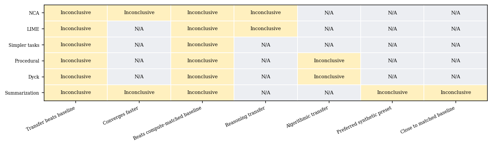
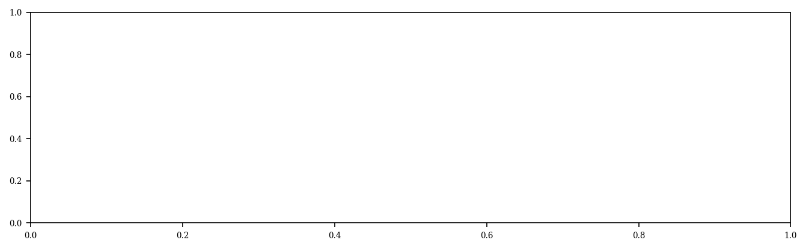
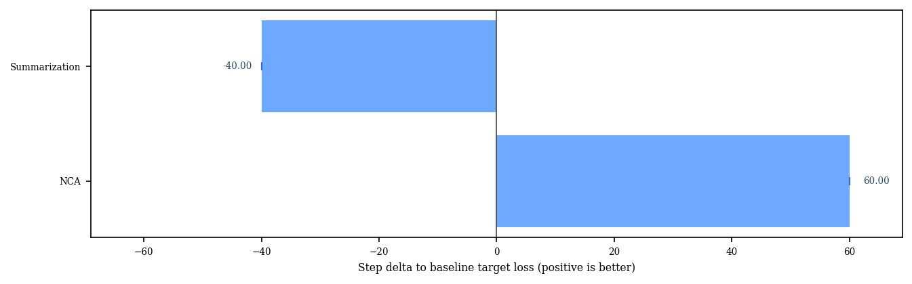
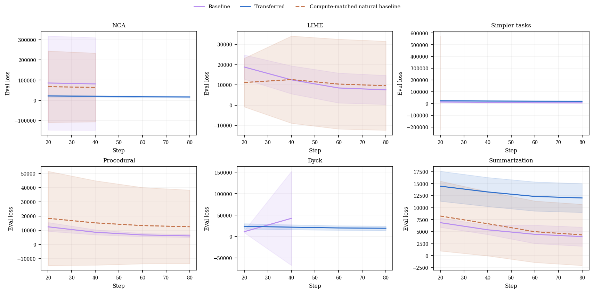
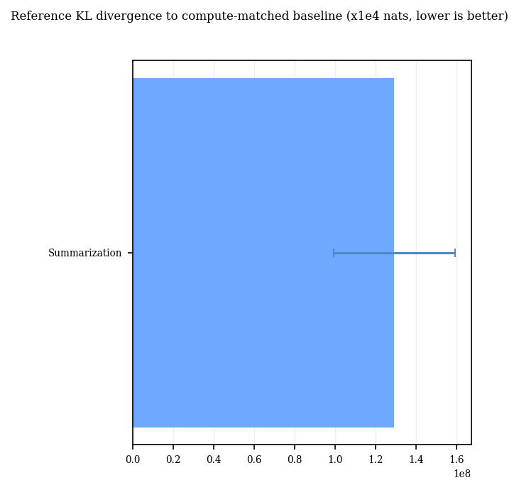
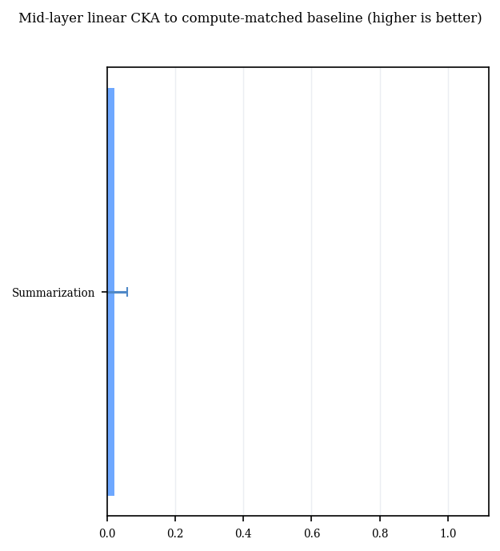
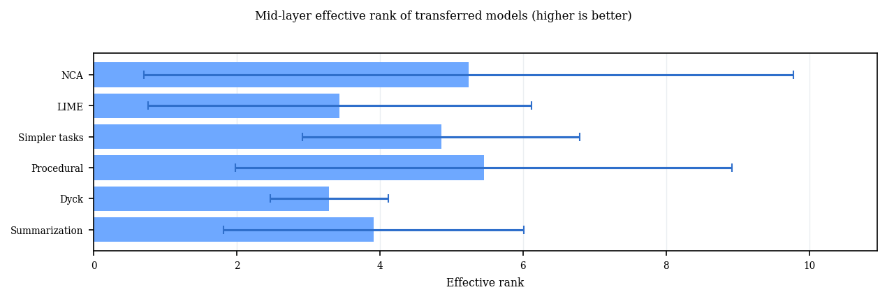
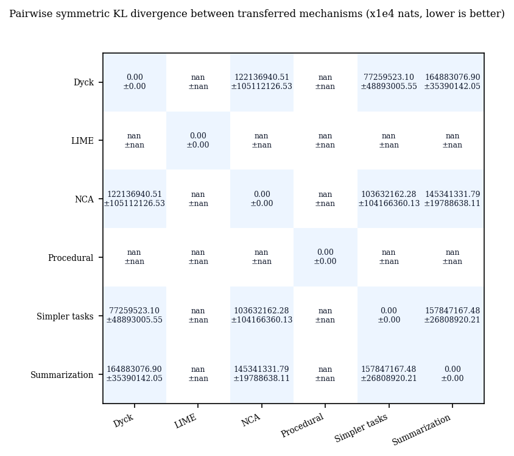
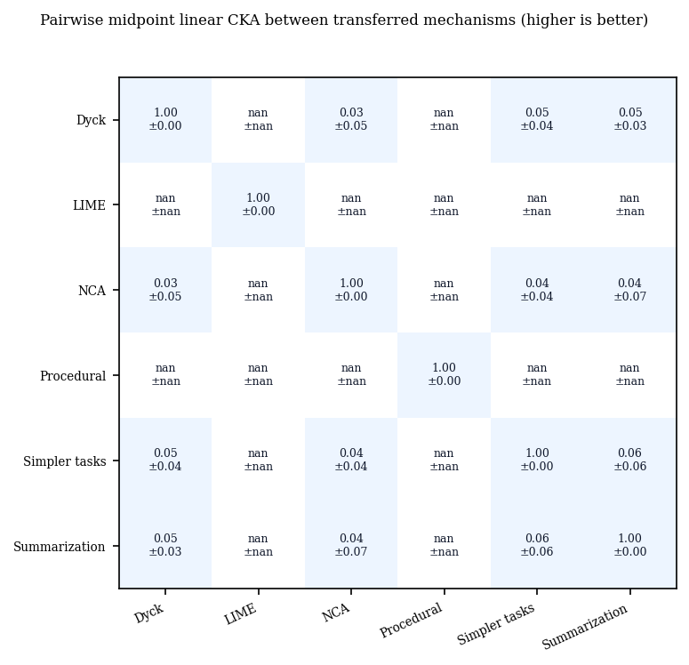
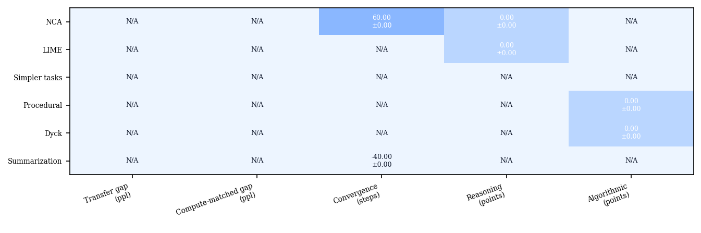

# Replication Report

This report summarizes a bounded multi-seed replication campaign across the current pre-pre-training mechanisms.
The goal is not exact paper reproduction, but a consistent check of whether each mechanism transfers in the expected direction under one shared setup.
All mechanisms are additionally evaluated against a compute-matched natural baseline built from natural-text warm-up on the same downstream text family.
Aggregated claim outcomes are based on a paired sign-flip hypothesis test across seeds rather than the earlier heuristic threshold.
In the table, `✅` means the target-direction claim was statistically supported, `❌` means the data significantly favored the opposite direction, `❔` means the result was inconclusive, and `➖` means the claim was not evaluated for that mechanism in this profile rather than missing data.

### Key Results

| mechanism | Transfer beats baseline | Converges faster | Beats compute-matched baseline | Reasoning transfer | Algorithmic transfer | Preferred synthetic preset | Close to matched baseline |
| --- | --- | --- | --- | --- | --- | --- | --- |
| NCA | ❔ | ❔ | ❔ | ❔ | ➖ | ➖ | ➖ |
| LIME | ❔ | ➖ | ❔ | ❔ | ➖ | ➖ | ➖ |
| Simpler tasks | ❔ | ➖ | ❔ | ➖ | ➖ | ➖ | ➖ |
| Procedural | ❔ | ➖ | ❔ | ➖ | ❔ | ➖ | ➖ |
| Dyck | ❔ | ➖ | ❔ | ➖ | ❔ | ➖ | ➖ |
| Summarization | ❔ | ❔ | ❔ | ➖ | ➖ | ❔ | ❔ |

### Claim Matrix Plot

This matrix shows the aggregated claim outcomes. Rows are mechanisms, columns are natural-language claim categories, and each cell reports whether the corresponding proxy claim was supported, contradicted, or left inconclusive after aggregating across seeds.

### Compute-Matched Baseline Gap

This plot shows the mean perplexity-point gap between each transferred run and its compute-matched natural baseline, with standard deviation across seeds. Positive values mean the synthetic pre-pre-training path outperformed the matched natural-text baseline.

### Perplexity Difference Compared To Baseline

This plot shows the mean final-evaluation perplexity difference between the transferred run and the baseline run with no pre-pre-training after the same downstream training budget, with standard deviation across seeds. Positive values mean the transferred model finished with lower perplexity than the baseline.

### Convergence Step Delta

This plot shows how many optimization steps earlier the transferred model reaches the baseline run's final loss level. Positive values indicate faster convergence.

### Loss Overlays

This figure overlays the downstream evaluation-loss curves for the baseline, transferred, and compute-matched natural baseline runs for each mechanism. Study-specific synthetic comparison presets are intentionally excluded so the overlay stays focused on the main replication comparison. Solid lines are means across seeds and shaded bands show one standard deviation.

### Logit Divergence To Baseline

This plot compares each mechanism's transferred model against its own compute-matched natural baseline using reference KL divergence over held-out downstream tokens. Values are plotted in x1e4 nats for readability. Lower values mean the transferred predictive distribution is closer to the matched compute baseline.

### Activation CKA To Baseline

This plot compares each mechanism's transferred model against its own compute-matched natural baseline using midpoint linear CKA on held-out downstream tokens. Higher values mean the internal representation geometry is more similar despite different parameter initializations.

### Activation Effective Rank

This figure measures the effective rank of midpoint hidden states for transferred models on held-out downstream tokens. Higher values indicate more diverse internal representations rather than collapsed activity.

### Pairwise Logit Divergence Matrices

This heatmap shows pairwise symmetric KL divergence between transferred mechanisms on one shared diagnostic text bundle. Values are shown as mean plus-or-minus standard deviation in x1e4 nats across seeds. Lower values indicate more similar predictive distributions.

### Pairwise Activation CKA Matrices

This heatmap shows pairwise midpoint linear CKA between transferred mechanisms on one shared diagnostic text bundle. Higher values indicate more similar internal representation structure.

### Effect Summary

This summary heatmap collects the main mechanism-level effect sizes in one place. Each column is scaled independently for readability and cell text shows the raw mean plus-or-minus standard deviation.

### Run Metrics

| mechanism | preset | seeds | baseline ppl | transferred ppl | natural baseline ppl | transfer gap | baseline gap | convergence delta | reasoning gain | algorithmic gain | transferred KL | transferred CKA | transferred rank | nca synth acc |
| --- | --- | --- | --- | --- | --- | --- | --- | --- | --- | --- | --- | --- | --- | --- |
| NCA | paper_web_text | 10 | nan ± nan | inf ± nan | nan ± nan | nan ± nan | nan ± nan | 60.000 ± 0.000 | 0.000 ± 0.000 pts | N/A | nan ± nan | nan ± nan | 5.239 ± 4.537 | 0.463 ± 0.334 % |
| LIME | paper_benchmark_100k | 10 | inf ± nan | nan ± nan | inf ± nan | nan ± nan | nan ± nan | N/A | 0.000 ± 0.000 pts | N/A | nan ± nan | nan ± nan | 3.440 ± 2.684 | N/A |
| Simpler tasks | paper_unary_core_100k | 10 | inf ± nan | inf ± nan | nan ± nan | nan ± nan | nan ± nan | N/A | N/A | N/A | nan ± nan | nan ± nan | 4.859 ± 1.937 | N/A |
| Procedural | paper_set_len64 | 10 | inf ± nan | nan ± nan | inf ± nan | nan ± nan | nan ± nan | N/A | N/A | 0.000 ± 0.000 pts | nan ± nan | nan ± nan | 5.453 ± 3.471 | N/A |
| Dyck | paper_k64 | 10 | nan ± nan | inf ± nan | nan ± nan | nan ± nan | nan ± nan | N/A | N/A | 0.000 ± 0.000 pts | nan ± nan | nan ± nan | 3.291 ± 0.826 | N/A |
| Summarization | paper_ourtasks_subset_100k | 10 | inf ± nan | inf ± nan | inf ± nan | nan ± nan | nan ± nan | -40.000 ± 0.000 | N/A | N/A | 1.29e+04 ± 3.00e+03 | 0.022 ± 0.038 | 3.912 ± 2.096 | N/A |

NCA note: the held-out synthetic next-patch token accuracy was 0.46 ± 0.33% across seeds, which is a direct upstream diagnostic rather than a downstream transfer metric.
